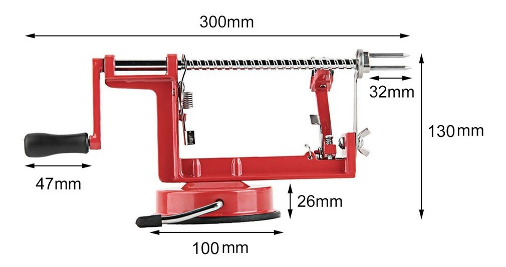
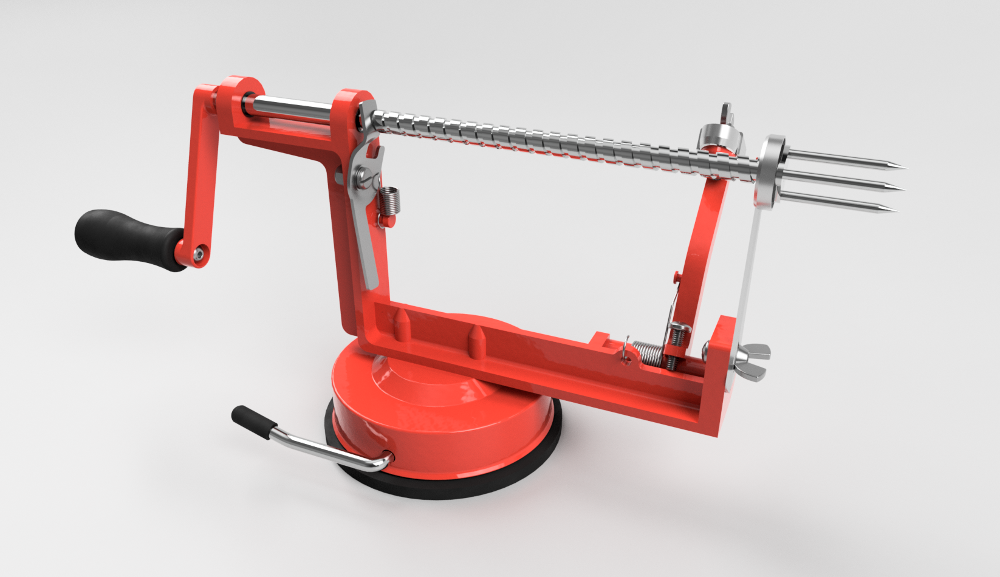

When I was younger, I was fascinated by the apple peeler-corer-slicer we had in our kitchen. It replaced three distinct steps with a single motion — plus the shapes involved (the spiral on the shaft, the three-pronged spear for the core) were complex and beautiful. When my Mechanical Synthesis class ([MAE 2250](https://classes.cornell.edu/browse/roster/SP21/class/MAE/2250)) assigned the task of replicating a kitchen object in Fusion 360, I knew this contraption would be perfect.

However, two problems presented themselves: the shapes involved were complex, and we had gotten rid of our peeler-corer-slicer years ago. Luckily, I was able to find a nice image of a similar model online, including some rough dimensions:

Un-luckily, there was no way around the complexity of the geometry. But its beauty and my love of CAD got me through, and the result is a near-identical copy of the picture.

All the joints are movable in the model: the shaft slides and rotates; the peeler arm tilts; the peeler blade can be adjusted; and the locking lever rotates to lock and unlock the shaft. The one shortcoming is that the tension spring on the locking lever doesn't stretch. I managed to get the torsion spring on the peeler arm to seem to twist: I modeled it in two halves, applied a cylindrical joint between them, and linked their motion to keep the wire coils perfectly overlapped with each other. Sadly, I didn't get a chance to record these motion capabilities before my access to the file was revoked at the end of the semester.